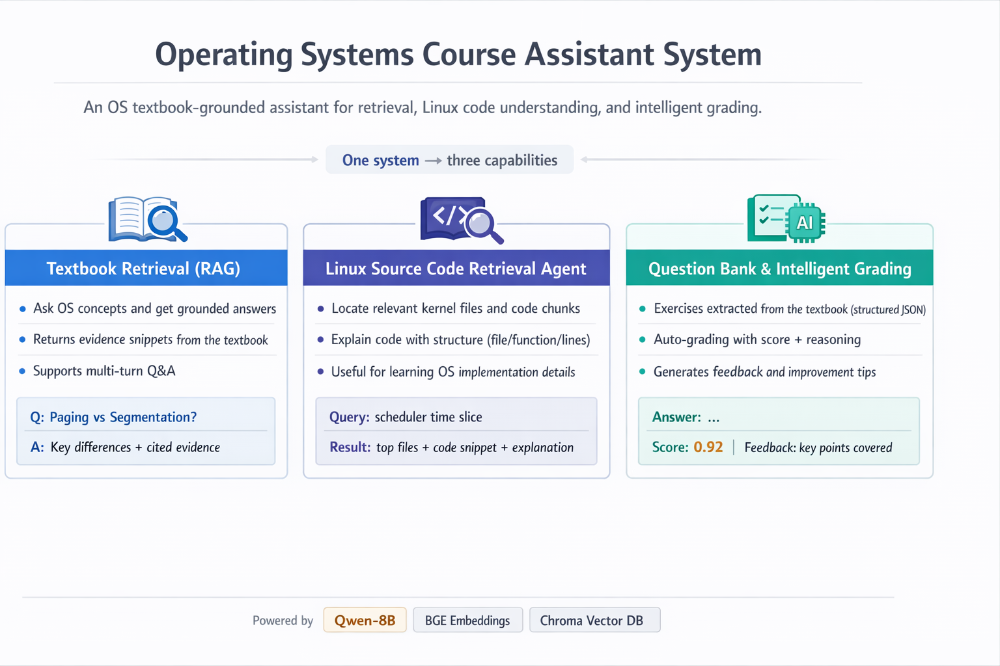

# RecomMind

**基于 Linux 教材与代码检索的 AI 教学辅助系统**


👥 开发团队：**CS糕手**

---

## 🤝 介绍

**RecomMind** 是一个面向高校《操作系统》课程的 AI 教学辅助系统，聚焦学生在学习过程中普遍存在的三类困难：

- 📚 教材内容篇幅大、知识点分散，**难以快速定位关键理论**
- 🧩 Linux 内核源码规模庞大、结构复杂，**理论与实现脱节**
- 📝 习题判题与解析依赖人工，**反馈慢、可解释性弱**

为此，RecomMind 以 **RAG（Retrieval-Augmented Generation）** 为核心技术框架，构建了一个集：

- **教材语义检索**
- **Linux 内核源码智能定位与讲解**
- **操作系统习题智能判题与解析**

于一体的教学辅助系统，目标是在**保证知识可靠性与可追溯性**的前提下，为学生提供接近“助教式”的学习支持。




> ### **文档导航**
> - 设计细节详见：[设计文档](docs/design/DESIGN.md)
> - 测试细节详见：[测试文档](docs/test/TEST.md)
> - 开发过程性文档见：[过程性文档](docs/process/PROCESS.md)


---

## 🎥 演示视频

> 📌 演示视频将在此处提供
---

## 🧭 技术路线

RecomMind 采用**前后端分离 + 多工作流并行的 RAG 架构**，围绕教学场景构建了清晰、可扩展的技术路线。
*详细设计文档：[设计文档](docs/design/DESIGN.md)*


### 1️⃣ 教材内容检索（Textbook RAG Workflow）

- 将操作系统教材进行**结构化切分与语义向量化**
- 支持自然语言提问（非关键词匹配）
- 多轮对话中可自动补全前置知识
- 生成回答严格基于检索到的教材片段，避免“脱离教材发挥”

### 2️⃣ Linux 源码检索（Code RAG Workflow）

- 面向 Linux 内核核心目录（如 `kernel/`、`mm/`）
- 采用**两阶段检索策略**：
    - 文件级摘要召回（快速缩小范围）
    - 代码块级语义重排（精准定位函数/逻辑）
- 返回结果包含：
    - 源码文件路径
    - 起止行号
    - 代码功能说明
- 实现“**以自然语言问题 → 精准源码定位 → 教学式讲解**”

### 3️⃣ 智能判题与解析

- 支持选择题、填空题、简答题等
- 判题过程引入教材检索作为**证据来源**
- 输出结构化结果：
    - 正误判断
    - 置信度
    - 推理依据
    - 知识点分析与改进建议
- 强调“**判得清楚、讲得明白**”，而非只给分数

---

## 🚀 快速使用

### 1. 获取代码

```bash
git clone <your-repo-url>
cd RecomMind
```

### 2. 启动后端

```bash
pip install -r requirements.txt
python3 backend_server.py
```

后端服务默认运行于：

```
http://localhost:5000
```

### 3. 启动前端

```bash
cd frontend
pnpm install
pnpm run dev
```

启动后即可通过浏览器访问系统界面。

---

## 📊 主要测试结果

项目构建了**分层测试体系**，从工程角度验证系统的可靠性与可复现性：
测试细节详见：[测试文档](docs/test/TEST.md)


### ✅ 功能与流程

- 教材 RAG 与源码 RAG 工作流均可稳定运行
- 支持多轮对话与异常输入回退
- 教材检索、源码检索、判题模块相互独立、协同工作

### 🧪 算法与逻辑测试

- 核心检索与决策流程均通过自动化测试
- 覆盖主要逻辑分支与典型异常场景
- 测试结果可重复、可复现

### ⚙️ 系统性能

- 教材检索与源码检索流程在真实环境下稳定执行
- 性能数据完整记录，便于后续分析与对比
- 满足教学场景下的交互实时性需求


> 📎 详细测试设计、用例与结果见项目配套测试文档。
> 开发过程性文档见：[过程性文档](docs/process/PROCESS.md)