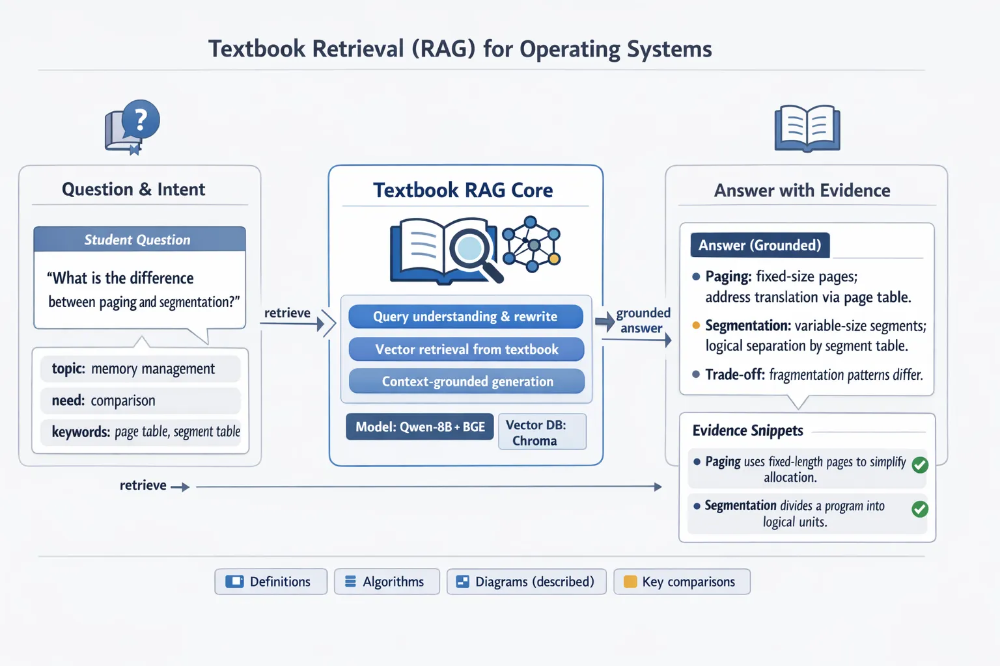
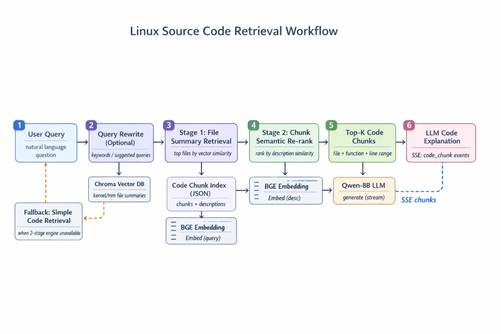
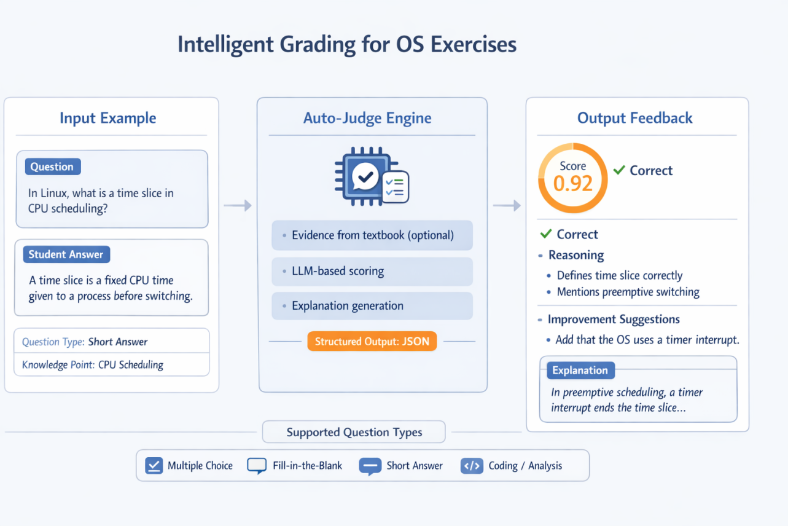

# 设计文档

# 背景与动机

高校操作系统课程涉及理论概念、内核源码和大量习题，学生往往在学习中遇到三个痛点：**查找教材知识费时**、**理解内核实现困难**以及**练习评测耗力**。传统做法下，学生需要翻阅教材、检索Linux源码，教师也需人工批改习题，效率和体验都有所不足。为此，我们设计了一个面向操作系统课程的智能助手系统。

本系统旨在服务于高校操作系统课程的教学辅助，提供一个智能**RAG**（Retrieval-Augmented Generation）助手，实现三大核心功能：教材内容智能检索、Linux 内核源码智能检索以及题库智能判题。通过该系统，学生和教师可以方便地检索操作系统教材中的相关内容，查询 Linux 内核源码实现细节，并对练习题目的学生答案进行自动判断和解析。系统定位为”操作系统课程内容智能检索助手”，能够分析用户提问意图并利用向量检索提供精准资料。总体目标是在保证信息可靠的前提下，为用户提供实时的参考资料和专业的回答/判题结果。

- **教材内容检索**：用户提出与操作系统教材相关的问题后，系统从预先构建的教材向量数据库中检索匹配的内容片段。教材素材通常以章节 PDF 格式存储并被切分嵌入。系统返回相关章节内容供大模型参考，用以生成回答。
- **Linux 源码检索**：针对涉及 Linux 内核实现的问题，系统在 Linux 内核代码的向量库中查找相关源码段落（重点涵盖 kernel/ 和 mm/ 等模块），并让大模型据此生成对代码的说明和解答。这一功能被称为”Linux 内核教学检索系统”。
- **题库智能判题**：对于操作系统课程的选择题、填空题、问答题，系统允许输入题干、选项（如有）和学生答案，通过大语言模型对答案正确性进行判定，并给出分析理由和分数置信度。同时，系统还能生成详细的题目解析，帮助学生理解知识点。

通过上述功能，本系统满足了课程教学中**资料查询**与**自动评估**的需求，提供了智能问答与判题支持，提升了师生学习体验。

*具体实现方案见[详细实现文档](IMPLEMENTS.md)*

# 系统总体设计

本系统采用前后端分离的**模块化架构**，由浏览器前端和 Flask 后端共同构成。前端提供Web界面作为协作区，学生可以在此提出问题、查看检索到的资料片段以及判题结果；后端则实现核心逻辑，通过RESTful API提供服务，并利用服务器推送(SSE)流实现答案的实时返回。系统整体功能围绕三大模块展开：教材内容智能检索、Linux 内核源码智能检索，以及习题智能判题与解析。这三部分既各自独立又协同工作，共同满足操作系统教学场景下“**问内容**”和“**评练习**”的需求。下图展示了系统的架构及主要组件：

*操作系统课程智能助手系统架构示意图。上图展示了前后端分离架构以及核心模块，包括教材检索工作流、源码检索工作流，以及判题与解析模块等。各模块通过清晰接口解耦集成，利用事件队列与SSE实现结果流式返回。*

在后端实现方面，我们设计了两个并行的**RAG 工作流**用于检索问答：一个针对教材内容（Textbook RAG Workflow），另一个针对Linux源码（Code RAG Workflow）。两套工作流结构相似，都包含**向量检索引擎**、**对话上下文管理**和**LLM回答生成**等组件，但数据来源和提示策略各有侧重。教材工作流侧重于课本文本章节内容，源码工作流则处理海量内核代码。它们通过统一接口集成到Flask后端对应不同API端点（如 `/api/chat` 提供教材/源码问答，`/api/code/query` 专供源码问答）。此外，系统还包括一个**智能判题模块**，提供判定习题答案正误、给分及解析的能力。判题模块与教材检索共用底层LLM，引入检索增强以确保判题理由有据可依。

为了保证各组件协调运作，系统采用**松耦合的模块设计**：不同功能通过事件总线和接口协议通信，彼此独立又可灵活替换。例如，检索引擎、语义重排、对话管理等模块之间通过明确的接口交互，底层模型和数据都可以按需更新而不影响整体架构。这一解耦设计为系统扩展打下基础——无论是替换向量数据库或嵌入模型，还是增加新的知识语料，抑或升级更强的大模型，都可较为方便地集成而不需推翻现有框架。总体而言，系统架构在保证功能丰富的同时注重可靠性与实时性：通过前后端协同与流式通信，用户提问后能即时获得检索反馈和逐步生成的答案，体验流畅自然。

# 关键模块设计与创新点

本系统围绕上述功能需求，在关键模块的设计上体现出多项创新，包括模块解耦协同的工作流设计、教材/源码双流程的结合、代码语义检索机制，以及智能判题的解释能力等。下面按模块分别介绍这些设计亮点。

### 模块解耦与协同工作流

**模块解耦**是系统架构的一大特点。教材检索工作流与源码检索工作流作为并行的两条流程，彼此独立实现但接口统一，均通过对话管理器接收用户查询并产出回答。它们共享底层的LLM模型和向量检索基础，但封装各自检索逻辑，做到“**一套框架，两种语料**”。这种设计保证了不同类型的问题各有优化：教材问答侧重知识点解释，源码问答侧重代码解析，但两者可以在同一会话系统中无缝协同。

在前端交互上，这两条工作流的协同体现为**双流程串联**：如果用户的问题同时需要教材讲解和源码佐证，系统允许教材检索与源码检索**同时开启**。后端会先执行教材RAG流程获取理论答案，然后衔接执行源码RAG流程获取代码片段说明，最终将结果**合并呈现在一次回答中**。在SSE推流中，系统通过特殊事件在两种回答间插入“相关源代码”分隔标题，使用户先看到文字讲解，随后看到对应的源码分析。这种双流程协同确保了回答的完整性和多层次：既有教材层面的概念阐释，也有源码层面的深入解析。例如，当学生问“进程调度的时间片大小由谁决定？”时，助手首先给出教材中关于时间片调度策略的说明，然后追加内核中相关代码实现的解析，让答案既有理论又有实践支撑。

值得一提的是，系统的**对话管理**模块会维护每轮问答历史，将用户提问及系统回答记录在教材或源码各自的会话上下文中。这样在多轮交互中，LLM能够参考近期对话保持连贯，检索模块也可以利用历史问题生成更精准的查询建议。这为复杂问题的分步探讨提供了支持，使协作区真正成为一个智能对话环境。

## 教材内容检索与RAG流程优化

针对操作系统教材的问答需求，系统实现了**Retrieval-Augmented Generation (RAG)**的流程，即通过检索教材内容来增强大模型的回答准确性。其工作流（SimpleRAGWorkflow）主要包括三个步骤：**查询理解与改写、向量检索、上下文回答生成**。

- **查询意图解析与改写**：为提高检索命中率，系统在收到用户提问后，首先调用一个轻量LLM组成的**检索建议生成器**（RetrievalSuggester）分析问题意图，提取关键词并生成若干重写的查询语句。这一模块通过预先设计的Prompt提示模型输出JSON格式的建议，包含用户意图、置信度、关键词及多条扩展查询。例如，用户原问可能是“进程调度的时间片大小是多少？”，建议器会识别其主题为“处理器调度”并生成如“操作系统 时间片 调度 机制”等查询，以扩大检索覆盖面。这种语义改写机制确保系统理解用户问题语境，生成比原始提问更有利于召回教材内容的查询词，大大提升了检索相关性。
- **教材向量检索**：检索模块将上述建议中的查询串联起来进行向量语义搜索。系统使用**Chroma**向量数据库预先索引了教材PDF章节内容，每段教材文字都被嵌入为向量并存储。对于每个查询，检索引擎利用嵌入模型（BGE-M3）将查询编码为向量，在向量库中寻找最近邻的文本段落。多条查询的结果合并后，系统会过滤重复并按匹配度排序，选出最相关的一批教材片段提供给LLM。在此过程中还应用了置信度阈值等规则，以保证检索内容既**丰富**又**精确**。
- **相关性判断与答案生成**：针对检索到的片段，系统并不盲目全部使用，而是让LLM先粗读这些资料并判断“是否足以回答问题”。这一步骤通过一个**“内容充分性判断”**提示实现：模型读取片段列表后，如果认为信息不完整，会反馈需要新的关键词。系统据此执行**第二轮检索**以补充资料，确保最终上下文覆盖问题所需要点。当资料准备充分后，LLM在提示的引导下参考这些片段生成答案，并尽量在回答中引用关键知识点或给出页码出处（如果需要）。最终呈现给学生的是一段融合了教材原文依据的回答，实现了**有据可依的解答**。这一流程充分利用教材权威资料，使回答既正确严谨又贴近课堂讲解风格。

通过以上环节，教材检索工作流将**向量语义检索**与**大模型生成**紧密结合：既克服了纯粹关键词搜索易遗漏相关内容的问题，又避免了大模型孤军奋战可能产生不准确回答的风险，在课程知识问答中取得了令人满意的效果。

## Linux 内核源码检索与语义排序机制

操作系统课程往往要求深入理解操作系统内核实现细节。本系统专门设计了**Linux 内核源码检索工作流**（CodeRAGWorkflow）来辅助这一需求，以实现对海量内核代码的智能查询和解释。相较教材检索，源码检索的难点在于：Linux内核源码体量庞大、结构复杂，如果仅靠常规搜索难以精准定位相关代码。为此，我们提出了一套**两阶段检索 + 语义重排**的方案，实现从上千源码文件中快速找到答案相关的代码段。

第一阶段是“**文件级摘要召回**”。我们预先对Linux内核源码进行了离线分析，每个源文件都生成了一个简要的**功能摘要**（例如通过静态分析提取模块、函数职责等）。这些摘要向量被分别存入针对不同子系统的Chroma向量库中（如 kernel、mm 等子库）。当有查询时，RetrievalEngine会先在文件摘要向量空间执行检索，在每个子库中各找出与查询语义最接近的若干个文件。然后将不同子系统的结果合并，选取全局相似度最高的Top N个文件作为候选。这样就把上千文件缩小到少数可能相关的范围，大幅降低后续处理量。这一阶段类似于目录筛选，确保**相关代码文件不被遗漏**。

第二阶段是“**代码片段语义重排**”。针对上一步选出的候选文件，系统进一步在其内部精细搜索相关代码段。我们预先为候选文件准备了**代码片段索引**：将文件按函数或逻辑段落切分，每段生成一段自然语言描述（说明该代码段的作用）并构建向量索引。RetrievalEngine 调用 `rank_chunks_by_description` 函数，将用户查询与候选文件中每个代码段的描述都用嵌入模型编码为向量，计算语义相似度并排序。得分最高的若干代码片段被认为最有可能回答用户问题。相比仅匹配关键词，这种基于语义的筛选更具智能：即使用户提问中使用的措辞和源码注释不同，模型也能通过语义相似度发现“暗含相关”的代码。例如用户问：“内存回收是如何实现的？”，源码里未必直接有“内存回收”的字样，但某段代码描述包含“内存回收（reclaim）机制”，语义匹配就会将其找出。经过这一语义重排，系统能够**精准锁定**实现相关功能的代码片段。

完成两阶段检索后，RetrievalEngine会将找到的Top代码片段按所属文件归组，打包包含文件路径、代码内容、功能描述等信息的结果列表返回。接下来，源码工作流进入**答案生成**阶段：与教材类似，我们将检索到的代码段作为上下文发给LLM。但提示上有所区别——模型被要求输出对这些源码的**讲解**而非直接给出答案。为此，我们构造了专门的prompt，将每段代码用Markdown代码块格式呈现，并附上文件名和行号等标注，引导模型逐一说明代码片段的作用、涉及的重要函数及逻辑，并结合提问给出解释。模型据此会生成一段面向人类的讲解性回答，如同助教在阅读代码后向学生做出的解释。这使得即使学生对源码不熟悉，也能通过助手的讲解明白代码在做什么、如何回答了原问题。

*Linux 内核源码检索两阶段工作流示意图。上图展示了从用户自然语言提问开始，经过可选的查询改写、文件摘要检索、代码片段语义重排，直到生成代码讲解的全过程。两阶段检索利用了预构建的文件摘要和代码描述索引，实现了对源码的语义级联筛选；在两阶段引擎不可用时系统会回退到简单检索策略以保证健壮性。*

为了支撑上述语义检索机制，我们在工程上实现了**预计算的代码索引**与高效内存查询。系统启动时会一次性加载所有代码块描述的全局索引（由多个JSON文件合并而成），并初始化嵌入模型用于编码。这样，当进行第二阶段重排时，无需再解析源代码或读取磁盘文件，只需在内存中快速计算相似度即可。这一设计显著提升了检索性能，使得即便面对上千文件、上万个代码段的庞大搜索空间，语义匹配仍能在秒级内完成。同时我们在索引构建时过滤掉了空白或无效的代码描述，保证模型不会被误导。可以说，这套**离线索引 + 在线语义重排**的方法，是源码智能检索模块的核心创新，它赋予了系统“理解代码含义”的能力，让代码层面的知识也能被大模型掌握和解释。

## 智能判题与答案解析

在教学场景中，自动评判学生练习答案并给出反馈同样是重要需求。为此本系统开发了**智能判题子系统**，利用大语言模型对选择题、填空题、简答题等多种题型进行统一的自动评分和解析生成。这一模块的创新之处在于结合课程资料进行判题，使模型判分有理有据，并通过结构化输出确保结果**可解释、易提取**。

系统提供两个主要接口：`/api/question/judge` 用于判断对错和给出评分依据，`/api/question/explanation` 用于生成详细解析。在实现上，这两者都调用了后端工作流中相应的判题方法，其中蕴含了相同的三步流程：**检索依据 -> LLM判分 -> 结果解析**。下面以选择题判分为例说明：

- **检索参考依据**：当收到判题请求时，系统会先将题目内容作为查询，在教材向量库中检索相关知识片段。这样做的目的在于获取判题所需的知识支撑，让模型判断对错时有所依据。检索到的内容将作为参考资料传递给模型。如果一题在教材中找不到相关片段，模型也会在没有参考的情况下尽力判分，但有资料时显然判断会更可靠。
- **提示构建与模型判分**：接下来系统构造一个详细的提示（Prompt）传给LLM，让其扮演“操作系统课程助教”，根据题目、选项、学生答案和检索到的资料进行分析判断。Prompt中明确要求模型以JSON格式给出输出，包含**isCorrect**（是否答对）、**confidence**（置信度）、**reasoning**（推理过程）、**correctAnswer**（正确选项）、**analysis**（题目详解）、**knowledgePoint**（考查的知识点）以及**optionAnalysis**（对每个选项的分析）等字段。通过严格限定输出结构，我们确保了模型回答的**可解析性**。模型收到提示后，会综合参考资料和自身知识进行推理，输出上述JSON结果。例如对于一道选择题，模型会给出其判断的正确选项、学生作答是否正确的判断、理由分析，以及每个选项为何对或错的解释。模型在这一过程中实际上执行了教学助教的思路：先给出正确答案，再对学生答案逐点分析说明，从而使评分结果**透明可追溯**。
- **结果解析与反馈**：由于LLM生成的文本需要转换为结构化数据，系统实现了结果解析器来提取JSON内容。解析器会清洗模型输出中多余的内容，用正则定位JSON片段并反序列化为数据对象。如果解析成功，就得到前述各字段的值；若不成功，系统触发**回退策略**，例如对于选择题就简单地比较学生答案和标准答案来判定对错，并生成提示“因模型输出解析失败，仅依据标准答案判分”。正常情况下，解析出的结构化结果将通过API返回前端，包括模型判定的正误、信心度以及详尽的分析信息。前端界面据此展示评分反馈，如“回答正确/错误”的判断和理由、模型给出的得分置信度，以及对各选项的点评。值得一提的是，如果开发者在接口请求中提供了标准答案，系统还会将模型判断的正确答案与标准答案比对，并在日志中记录二者是否一致。这一机制便于后续评估模型判题的准确率，但不会干预给学生的反馈内容（即使模型判断有误，前端仍会展示模型的结论，只是在后台告警）。

对于填空题和简答题等开放性问答，系统采用与选择题类似的流程，区别在于要求模型输出的JSON字段略有不同，侧重对答案内容的分析和改进建议。例如，简答题的解析会让模型评价学生答案的完整性和表述质量，输出字段包括**answerQuality**（答案质量）和**improvementSuggestions**（改进建议）等，从而给出比对错判断更深入的反馈。无论何种题型，我们都要求模型结合操作系统课程的知识点给出解释，因此它会将题目涉及的概念、正确答案的依据、学生错误的原因分析以及建议补充的知识点都写入解析，让学生明白自己错在何处、如何改进。

*智能判题与解析流程示意图。上图展示了判题引擎从题目和学生答案出发，先检索教材证据，然后由LLM进行判分和解析生成，最终输出反馈的过程。在结果反馈中，学生不仅能看到分数或正误判断，还能获得模型的推理依据以及改进建议。支持的题型包括选择题、填空题、简答题以及编程题等。*

通过上述设计，智能判题模块实现了对多种题型的统一自动评估。其特色在于**充分利用检索资料作为判分依据**，使得模型给出的评分理由有章可循，而非凭空判断。同时，**JSON结构化输出**的引入解决了大模型自由文本输出难以解析的问题，我们得以将模型的丰富反馈精准提取并呈现给用户。最终，学生在提交答案后，系统会即时返回反馈：不仅知道对错，还能看到模型给出的信心分数和详细分析，了解自己答案中正确或不足的部分；若仍有不解，还可以点击“生成解析”获取一段步骤清晰的参考答案讲解。这种**可解释的评析反馈**极大地方便了学生的自主学习，也为教师批改提供了参考，实现了评分与教学的有机结合。

# 用户交互流程

在实际使用中，系统的协作区以**对话问答**的形式为用户提供服务。下面通过典型场景，说明用户与系统交互的流程以及系统如何应用上述设计满足用户需求：

- **课程知识问答场景**：学生在协作区提出有关教材或理论的问题，例如“虚拟内存中的页表有什么作用？”。系统首先解析提问意图并生成检索查询，实时从教材知识库中查找相关章节段落。很快，前端会流式显示“已检索到N条相关资料”，列表中展现教材片段标题等信息。接着，大模型根据检索到的内容生成回答，同样以流式文本形式逐步出现在对话框中。整个过程中，学生能够清楚地看到检索和思考的动态：例如系统先提示“检索到X个片段，正在生成回答…”，随后答案一句句呈现。这种即时反馈让学生仿佛置身于与智能助教的互动中。当回答完成后，如果学生还有疑问，可以继续追问细节，系统会利用**对话上下文**理解连续提问，给出连贯的解答。相较于传统翻书或网络搜索，这一过程**高效且具有针对性**：学生得到的回答引用了教材权威内容，有理有据，避免了不确定来源的信息干扰。
- **源码探索场景**：当学生提出与操作系统实现相关的问题，如“Linux如何跟踪进程的CPU使用时间？”，系统将自动触发源码检索流程。首先返回的可能是一段对这一机制的文字解释，然后在答案下方专门划出“相关源代码”区域，紧跟着流式输出相关的代码段解析。例如，系统会找到 Linux 内核中负责统计进程CPU时间的代码，并解释该代码的关键逻辑和函数调用。学生可以一边阅读文字讲解，一边参考代码片段，加深对实现细节的理解。这种**理论+代码**的双重回答方式，使抽象概念和具体实现形成呼应，满足了高级学习者探究源码的诉求。在这个交互过程中，前端会先后收到两类SSE事件：教材回答完成 (`textbook_done`) 后紧接着启动源码检索，插入分隔标题，再输出代码讲解，最终发送完成信号 (`code_done`) 通知前端关闭连接。对用户而言，这一切都是无缝的：他们只需提出一个问题，系统即给出分层次的综合答案，探索问题的方方面面。
- **练习判题场景**：学生在练习后，可以将自己的答案提交给协作区的判题助手。以一道选择题为例，学生勾选了答案并点击提交，系统后台会立即检索教材中与该题相关的知识点片段，并将题干、学生答案及参考资料打包发送给LLM判分。数秒内，前端就会收到模型生成的结果JSON，并解析显示反馈：例如“回答错误，正确答案为B”。同时学生还能看到模型给出的理由，例如“你的答案忽略了进程调度的抢占条件”以及信心度（比如置信度只有60%说明模型也不太确定）。这些细节帮助学生了解**错因**和**正确思路**。随后学生可以点击“生成解析”，系统将再次利用LLM生成一段详尽的文字解析，包括该题考查的知识点、正确答案的解释以及错误选项的迷惑性分析等。这一解析直接以段落形式呈现，语言通俗易懂、条理清晰，方便学生学习巩固。这一交互体现了智能判题模块的人性化设计：不仅给分，更重视教学意义上的反馈。对于学生来说，做题立即有了针对性的讲解反馈，及时弥补了认知漏洞；而对于教师而言，也减轻了批改负担并保证了评判的一致性和客观性。

通过以上场景可以看出，系统的协作区功能贯穿了**提问-解答-反馈**的全过程。从学生视角出发，无论是问课程内容、查源码实现，还是提交练习答案，系统都能实时响应并给出丰富的基于资料的结果。这种流畅的交互体验背后，凝聚的是检索增强型大模型工作流、高效的异步通信(SSE)机制以及精心设计的提示与解析策略。它们共同构成了一个闭环的智能教学辅助：**问题驱动 -> 检索知识 -> 模型生成 -> 可视化呈现 -> 根据需要深入追问或解析**，有效地提升了操作系统课程的学习效率和互动体验。

# 总结与展望

综上所述，本项目构建了一个面向操作系统教学的智能助理系统，将大语言模型的强大生成能力与课程资料的检索相结合，在**知识获取**和**智能评测**两方面为师生提供了创新解决方案。系统通过模块化架构实现了教材内容和源码知识的解耦协同，既可分别针对不同类型问题优化，又能在需要时串联发挥作用，提供从原理到实现的全方位解答。**两阶段语义检索**的设计使海量源码不再是信息检索的障碍，模型能够“读懂”代码描述并定位关键片段，填补了教学中源码剖析的自动化空白。同时，**智能判题模块**充分利用课程资料佐证和结构化输出，实现了对学生练习的精准、公平且有解释的自动评分。这些技术亮点紧密围绕教学痛点，体现出较高的工程价值和创新性。

在工程实现上，系统采用4-bit量化模型和预先构建的索引，使得在消费级GPU上也能流畅运行复杂的检索与推理任务。嵌入模型BGE的引入保障了中英文混杂语境下的向量表示效果，有效提升了检索准确率。得益于良好的模块边界设计，系统具备**良好的扩展性**：当教材内容更新或需要支持新的内核模块时，只需增量地更新向量库或索引数据即可；更换底层大语言模型也很方便，只要其接口兼容且具备相应语言能力。这一点对于后续将系统推广到其他课程领域或升级更强AI模型具有重要意义。

展望未来，该智能助教系统可以有多方面的改进和扩展空间。例如，我们可以进一步丰富知识库，加入经典论文、实验指导等资料，以拓展系统能回答的问题范围；升级模型规模或引入强化学习优化提示，提升回答质量和准确性；增加对编程题的自动评测，结合动态分析手段为代码类习题提供反馈等等。随着大模型技术和教育智能化的不断发展，我们有理由相信，这类“课程智能助手”将在更多学科领域落地，为因材施教、自主学习提供强有力的支撑。

本系统的实践证明，将检索技术与生成式AI相融合，能够有效地解决教学场景中的知识获取和答疑解惑难题。在操作系统课程这个复杂度较高的领域，我们的解决方案成功构建了一个**结构合理、问题导向清晰**的“解决方案故事”：围绕教学中的实际问题，以模块化的设计逐一攻克，实现了教学体验的升级。总而言之，本文档所述系统为高校操作系统课程提供了一个高效、智能的辅助平台，既减轻了教师负担，又激发了学生学习的积极性，为教育信息化和个性化教学探索出一条可行路径。作为结语，我们期待在未来的教学实践中，更多地看到人工智能技术与教育场景深入融合，产生更丰富的协同效应，帮助师生获得更好的教学相长体验。