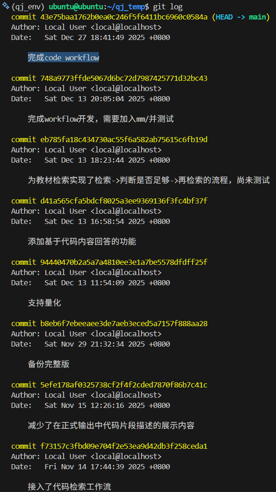
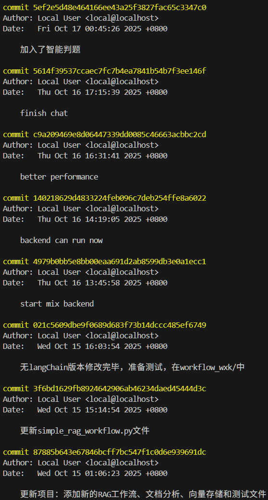
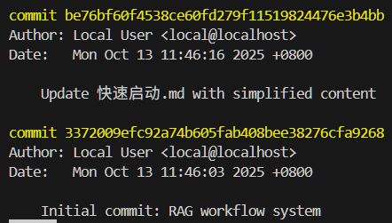

# 会议记录和Git Log

## 操作系统智能体项目研发过程会议记录

### 第 1 次研发会议：项目愿景、异构数据源分析与数字化基座建设

日期： 2025-09-23

会议摘要： 确立“基于RAG与大模型协同技术的操作系统智能体”研发方向，旨在消除学生在学习中“理论抽象化”与“代码复杂化”之间的鸿沟。

- **业务痛点深度研讨：**
    - 团队达成共识：教材理论严密但离散，学生面对 Linux 内核千万行级 C 代码时缺乏切入点。
    - 确立系统必须支持自然语言交互、意图解析、智能题目解答，以及最核心的源码精准引用功能。
- **异构数据预处理策略：**
    - **教材路径**：针对 PDF 复杂的排版和多模态干扰，采用“微型分片”技术。
    - **技术路线**：通过 Python 脚本识别 PDF 字体权重、缩进及页眉信息，将教材转化为具有父子节点关系的 JSON 树状结构。
    - **上下文注入**：切片（Chunking）时自动附带所属章节元数据（如：第三章 > 存储管理），确保检索结果携带逻辑背景。
- **初期任务分配：**
    - **秦江**：负责第 3-8、11-12 章节的高强度 PDF 切分与文本对齐，确保公式逻辑完整。
    - **胡涵清**：负责第 1-2、9-10 章节数据处理，建立初始索引标签库。
    - **董壮志**：作为数据总架构师，负责第 13 章切分并主导全员数据的压缩汇总与 JSON 质量校验。

---

### 第 2 次研发会议：Workflow 架构建模与 Qwen 本地模型部署

日期： 2025-09-25

会议摘要： 完成从静态数据到动态问答流程的架构跨越，重点在于 Workflow 逻辑闭环。

- **RAG 工作流建模：**
    - 确立四阶段调度逻辑：1. 用户 Query 输入；2. LLM 分析意图并总结检索建议；3. 系统匹配教材 Chunk；4. 融合上下文生成最终回答。
    - 为了应对延迟并确保数据隐私，**秦江**提出部署本地 Qwen 模型，并配置镜像环境。
- **语义向量化（Embedding）选型：**
    - **董壮志**提出对教材 Chunk 进行深度 Embedding 存储，支持语义检索而非关键词匹配。
    - **胡涵清**协助进行了“进程管理”章节的入库测试，验证检索在 Top-K 模式下的准确性。
- **下一步分工：**
    - **秦江**：负责 Workflow 代码实现及非 Embedding 逻辑开发。
    - **董壮志**：负责 Embedding 模型选型、脚本开发与向量库初始化。
    - **胡涵清**：负责服务器环境维护与后端检索系统初测。

---

### 第 3 次研发会议：RAG 逻辑融合、前端原型与“元题库”出题方案

日期： 2025-10-02

会议摘要： 功能版图从问答扩展至智能命题领域，对齐前后端交互逻辑。

- **前端展示痛点解决：**
    - **秦江**展示前端原型，通过 iframe 嵌入展示 PDF，解决检索结果“空对空”的问题。
    - **董壮志**提出对话历史管理需求，确保 LLM 能结合上下文进行多轮追问。
- **智能出题逻辑设计：**
    - 针对 LLM 直接出题产生的幻觉风险，**胡涵清**提出收集“元题库”，让模型基于真实题干进行“语义转换”出题。
    - **董壮志**强调需支持难度、知识点比例的细颗粒度抽题设置，采用敏捷开发模式。
- **组织管理**：讨论经费分配，优先保证 API 调用开销，剩余作为项目激励。

---

### 第 4 次研发会议：原生化架构重构与移除 LangChain 的技术决策

日期： 2025-10-14

会议摘要： 经历深刻技术反思，决定放弃 LangChain 框架转向纯原生开发。

- **架构反思与重构：**
    - **秦江**指出 LangChain 存在“黑盒”问题，导致多轮对话响应延迟高且意图识别不稳定。
    - **董壮志**支持原生方案，认为直接操作模型 API 能更精准控制 RAG 召回权重，减少冗余封装。
- **交付准备：**
    - **胡涵清**负责对题库 JSON 最终核对并确保图床链接有效。
    - **秦江**与**董壮志**完成无 LangChain 版本的重测，并引入 `ConversationManager`。
- **UI 优化**：解决思考过程左对齐、数学公式渲染不全等问题，增大展示窗体。

---

### 第 5 次研发会议：内核源码“三属性”表征模型与语义捆绑技术

日期： 2025-10-21

会议摘要： 启动千万行级内核源码检索模块开发，攻克语义偏移难题。

- **源码表征困境分析：**
    - 讨论发现直接检索 C 源码导致召回率极低，因自然语言与代码逻辑存在模态差异。
    - **董壮志**提出语法感知切片算法：提取文件头定义，每 100 行左右切分为一个逻辑 Chunk。
- **“以意释码”方案：**
    - **秦江**提出为源码 Chunk 生成 LLM 语义描述（Description）。
    - 系统存储 [代码原文本 | 代码语义解释]，检索时仅对解释向量进行匹配，解决语义偏移。
- **任务执行分工：**
    - **董壮志**：负责源码预处理与分块切割。
    - **秦江**：负责调用 LLM 批量生成源码描述并人工修正重复项。
    - **胡涵清**：负责向量数据库物理构建与首轮检索效果测试。

---

### 第 6 次研发会议：二段式检索优化与校外服务器生产环境迁移

日期： 2025-10-28

会议摘要： 针对内核检索速度与准确率，实现二段式过滤逻辑并完成部署。

- **检索路径层级化改造：**
    - **董壮志**设计新算法：先检索文件级总结（.md）锁定最相关的 3 个文件；再在其中匹配 Top-5 Chunk。
    - 这种“粗排+精排”方式极大减少了向量空间的噪声干扰。
- **生产环境迁移：**
    - **胡涵清**成功配置服务器，解决数据库大规模迁移后的同步与索引重建问题。
    - **秦江**重构前端 API，支持展示源码具体起始行号，实现精准溯源。

---

### 第 7 次研发会议：源码建议 Agent 开发与 UI 降噪布局优化

日期： 2025-11-08

会议摘要： 提升交互深度，优化建议生成机制与界面美感。

- **查询建议 Agent：**
    - **秦江**实现专门产生搜索关键词（suggest_query）的 Agent，模拟专家搜索思路。
    - 机制要求综合多轮对话历史，避免无效的重复建议。
- **前端布局降噪：**
    - **胡涵清**在测试中反馈描述内容过长导致信息过载。
    - **董壮志**提出压缩展示内容权重，实现“精简摘要+完整代码引用”的均衡布局。

---

### 第 8 次研发会议：Agent 工作流深度重塑——从“搜索工具”到“深度问答”

日期： 2025-11-29

会议摘要： 系统定位正式从“检索工具”升级为“代码问答专家”，实现理论与实践深度融合。

- **协同推理实现：**
    - **董壮志**指出此前 LLM 生成回复仅使用了检索到的教材切片，未深度引用代码逻辑。
    - 决定重构 Workflow，将代码片段直接注入 Prompt，强迫模型进行“按图索骥”式的深度解读。
- **专项计划：**
    - 启动 `/mm` 目录深度解构，**秦江**负责文件级理解，**董壮志**运行脚本进行函数级分块解析。
    - 项目更名并移除冗余登录界面，正式适配教材场景。

---

### 第 9 次研发会议：mm/ 模块全量并库、Bug 清零与最终性能评测

日期： 2025-12-20

会议摘要： 解决复杂逻辑下的解析不充分问题，完成项目定型。

- **数据并库与迭代检索：**
    - 代码 RAG 已完整整合 `/mm` 目录内容。
    - **秦江**通过“检索->反思->再检索”机制，解决内存管理模块深层级关联查询丢失问题。
- **核心 Bug 攻关：**
    - 针对复杂 C 语言状态机逻辑解析不全的问题，由**秦江**负责代码层面修正。
    - **胡涵清**负责基于 F1-Score 指标对新架构进行最终评测。
- **收官准备：** **董壮志**复核教材适配度，确保前端展示在 12.21 前完美闭环。

## Git Log

